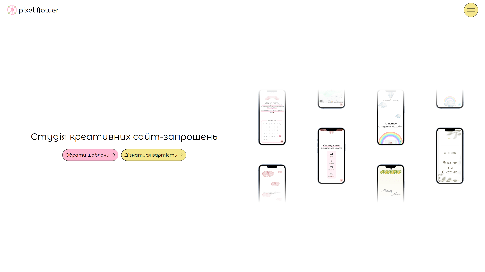

# pixel flower

August | 2025

I designed and developed a modern, responsive website for a business offering custom site-envelopes (mini-websites) for weddings, christenings, and other special events. The goal was to create a visually appealing, easy-to-use platform where clients could explore templates, compare pricing options, and learn about the service.

